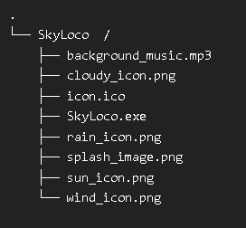

# SkyLoco

A simple weather application built in Python using PyQt5, providing real-time weather information, forecasts, and more. The app supports dynamic icons, dark mode, and light mode, and gives weather alerts for severe conditions.

## Compiling


## Features
- Displays **current weather conditions**.
- Shows **forecast** for the next few days.
- Offers a **sidebar** for navigation.
- **Weather icons** change dynamically based on weather conditions.
- Supports **light mode** and **dark mode**.
- **Custom notifications** for severe weather alerts.
- Allows **manual city input** if GPS location is not available.

## Installation

1. Clone the repository or download the files.

2. Create a virtual environment (optional but recommended):

    ```bash
    python -m venv venv
    ```

3. Activate the virtual environment:
    - **Windows**:
        ```bash
        venv\Scripts\activate
        ```
    - **macOS/Linux**:
        ```bash
        source venv/bin/activate
        ```

4. Install the dependencies:

    ```bash
    pip install -r requirements.txt
    ```

5. Run the app:

    ```bash
    python main.py
    ```

## License

This project is licensed under the MIT License - see the [LICENSE](LICENSE) file for details.

## Contributing

Feel free to submit issues or pull requests. Contributions are welcome!

